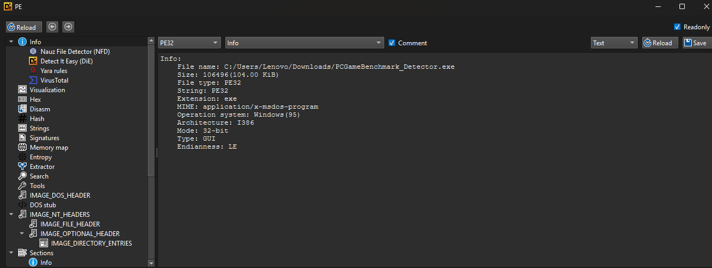
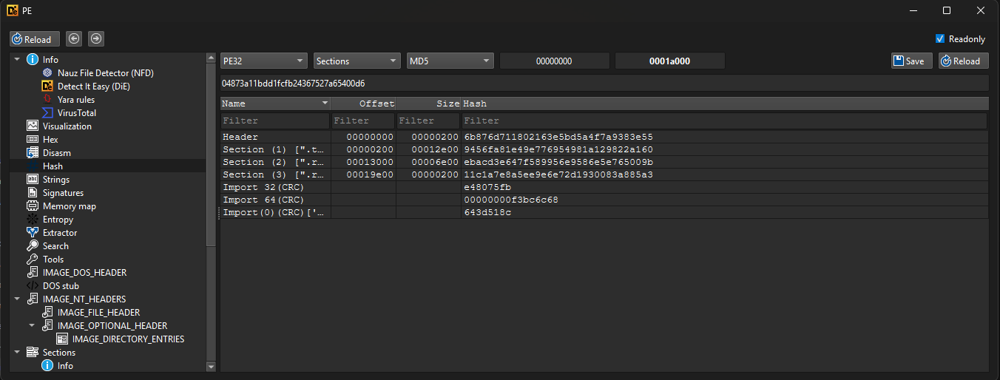
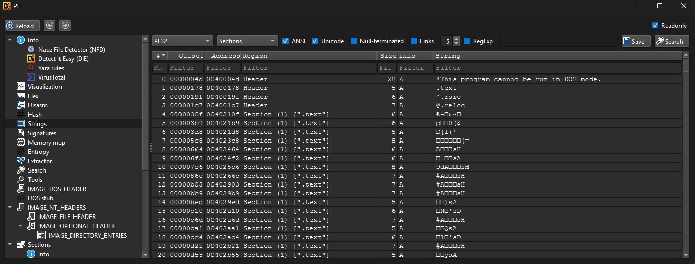
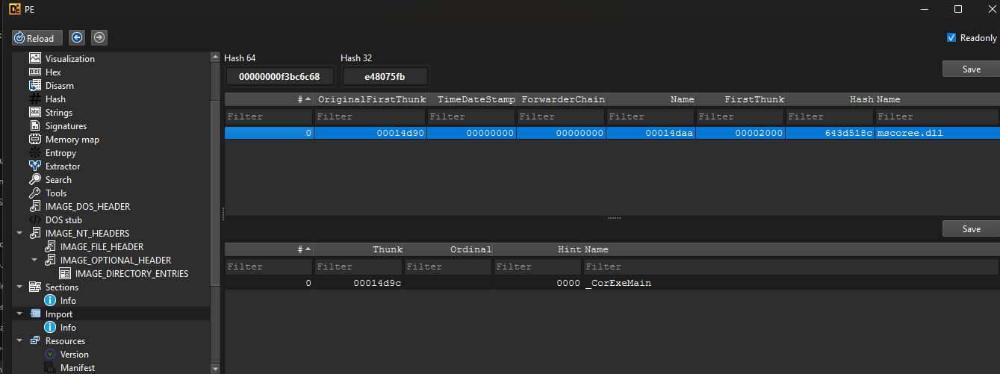

# Laporan Analisis Statis 01: PCGameBenchmark_Detector.exe

---

## 1. Triage (Identifikasi Awal)

Langkah pertama dalam analisis statis adalah mengidentifikasi sifat dasar dari file *binary* yang sedang kita hadapi menggunakan *tools* Detect It Easy (DIE).

### Informasi File Utama
Berdasarkan analisis menggunakan Detect It Easy (DIE):

- **Nama File Asli:** `PCGameBenchmark_Detector.exe`
- **Ukuran File:** `106496 bytes (104.00 KiB)`
- **Tipe File:** `PE32` (Portable Executable untuk sistem operasi Windows)
- **Arsitektur:** `I386` (Mode 32-bit)
- **Tipe Eksekusi:** `GUI` (Berjalan dengan antarmuka grafis, bukan sekadar *command-line* terminal)
- **Sistem Operasi Target:** `Windows (95)`

### Ekstraksi Hash
Untuk memastikan integritas file dan memberikan identifikasi unik (IOC), saya mengekstrak nilai *hash* menggunakan fitur bawaan DIE:

- **MD5 Hash:** `04873a11bdd1fcfb24367527a65400d6`

*(Nilai hash ini sangat penting untuk dibagikan kepada analis lain atau dicari di database seperti VirusTotal untuk melihat rekam jejak file ini).*

---

## 2. Analisis Strings (Teks Terbaca)

Langkah selanjutnya adalah memeriksa *strings* atau teks yang dapat dibaca manusia di dalam *binary*. Hal ini sering kali membocorkan informasi mengenai *library* yang digunakan, pesan *error*, atau bahkan *URL/IP Address* yang mungkin dihubungi program.

Berdasarkan ekstraksi awal pada bagian `.text` (bagian utama eksekusi instruksi), terlihat beberapa temuan:
- Ditemukan string standar DOS *stub*: `!This program cannot be run in DOS mode.`
- Sebagian besar teks di bagian awal *section* eksekusi ini terlihat seperti kumpulan karakter acak atau *garbage code*. Ini bisa menjadi indikasi awal bahwa kode program mungkin telah melalui proses *obfuscation* (pengaburan) ringan atau *packing*, meskipun DIE tidak secara eksplisit mendeteksinya di halaman *triage* awal.

---

## 3. Import Table (Tabel Impor)

*Import Table* adalah daftar fungsi dari pustaka luar (*Dynamic Link Libraries* / DLL) yang dipinjam oleh program ini untuk bisa berjalan. Menganalisis ini sangat krusial untuk menebak apa saja "kemampuan" dari program tersebut.

Temuan dari *Import Directory*:
- **DLL yang Diimpor:** `mscoree.dll`
- **Fungsi yang Dipanggil:** `_CorExeMain`

---

## 4. Kesimpulan Awal

Berdasarkan proses analisis statis sederhana di atas, berikut adalah kesimpulan awal mengenai kapabilitas dan fungsi dari `PCGameBenchmark_Detector.exe`:

1.  **Berbasis .NET Framework:** Temuan paling signifikan adalah pada bagian *Import Table*. Program ini HANYA mengimpor satu buah pustaka eksternal, yaitu `mscoree.dll` dan memanggil fungsi tunggal `_CorExeMain`. Ini adalah tanda pasti dan mutlak bahwa program ini ditulis menggunakan **C#** atau bahasa **.NET Framework** lainnya. Program PE reguler (seperti C/C++) biasanya akan mengimpor `kernel32.dll` atau `user32.dll`.
2.  **Keterbatasan Analisis *Disassembly* Tradisional:** Mengingat program ini adalah aplikasi .NET (berisi kode IL/Intermediate Language, bukan instruksi mesin murni x86), maka fitur *disassembly* atau analisis *strings* tradisional (seperti pada gambar `string_2.png` yang terlihat berantakan) tidak akan terlalu efektif.
3.  **Tujuan Program:** Dilihat dari namanya (`PCGameBenchmark_Detector.exe`) dan sifatnya yang berupa aplikasi GUI, program ini kemungkinan besar adalah sebuah alat (*utility*) kecil yang dibuat dengan C#/.NET untuk memindai spesifikasi perangkat keras (CPU, RAM, GPU) komputer pengguna, mungkin untuk mencocokkannya dengan kebutuhan spesifikasi sebuah *game*.
4.  **Rekomendasi Analisis Lanjutan:** Untuk membedah isi sebenarnya dari aplikasi ini, kita tidak bisa menggunakan Ghidra atau debugger standar (x64dbg). Kita WAJIB menggunakan *tools* khusus .NET Decompiler seperti **dnSpy**, **ILSpy**, atau **dotPeek** untuk melihat langsung kode sumber C#-nya secara hampir utuh.
