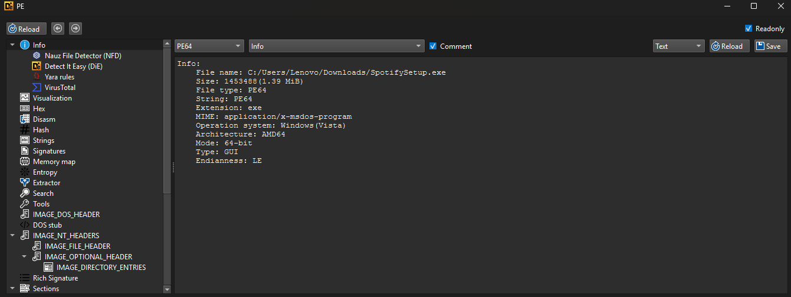
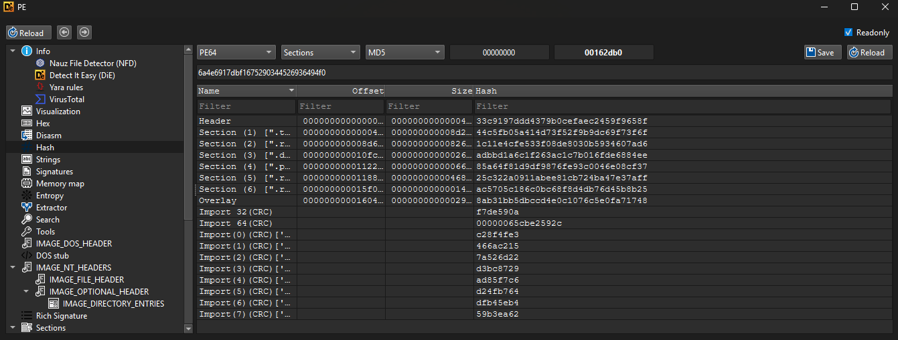
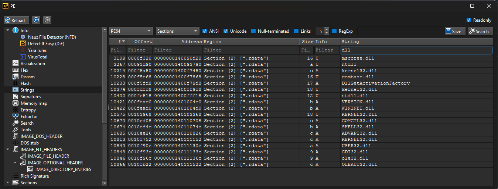
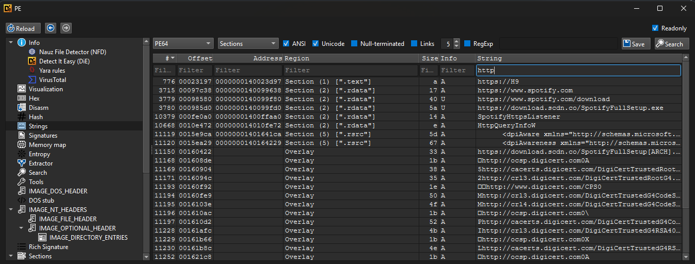
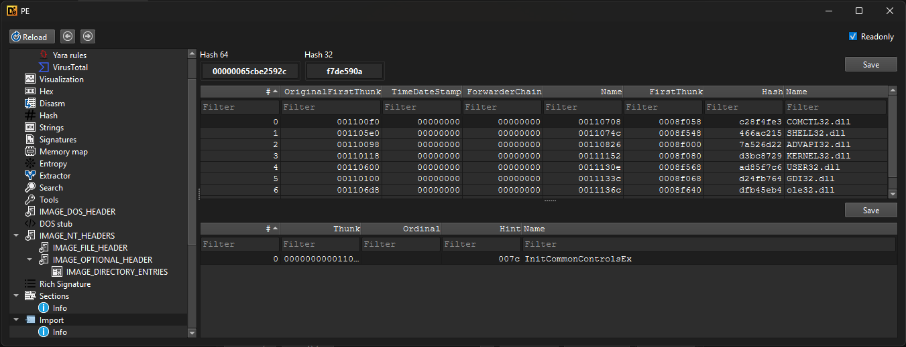

# Laporan Analisis Statis 02: SpotifySetup.exe

---

## 1. Triage (Identifikasi Awal)

Analisis dimulai dengan memeriksa metadata dan struktur dasar *binary* menggunakan Detect It Easy (DIE).

### Informasi File Utama
Berdasarkan hasil pemindaian informasi file:

- **Nama File Asli:** `SpotifySetup.exe`
- **Ukuran File:** `1453488 bytes (1.39 MiB)`
- **Tipe File:** `PE64` (Portable Executable untuk sistem operasi Windows)
- **Arsitektur:** `AMD64` (Mode 64-bit)
- **Tipe Eksekusi:** `GUI` (Aplikasi dengan antarmuka grafis)
- **Sistem Operasi Target:** `Windows (Vista)`

### Ekstraksi Hash & Sections
Pemindaian pada struktur *hash* dan *sections* memberikan gambaran tentang komponen penyusun file ini:

- **MD5 Hash:** `6a4e6917dbf1675290344526936494f0`
- **Sections:** Terdapat bagian-bagian standar seperti `.text` (kode program), `.rdata` (data konstan), `.data`, dan `.rsrc` (resources).
- **Overlay:** Hal yang paling menarik adalah keberadaan bagian `Overlay`. Dalam konteks aplikasi *installer* atau *setup*, *overlay* biasanya digunakan untuk menyimpan muatan data ekstra (seperti arsip kompresi) atau tanda tangan digital (*digital signature*) yang tidak dimuat langsung ke memori saat program dijalankan.

---

## 2. Analisis Strings (Teks Terbaca)

Pemeriksaan *strings* dilakukan untuk mencari indikator kompromi (IOC) atau petunjuk terkait cara kerja program, khususnya yang berkaitan dengan aktivitas jaringan dan pemuatan pustaka.

### Indikator Jaringan (HTTP/URL)
Pemfilteran *strings* dengan kata kunci `http` mengungkap banyak informasi berharga:

- **URL Unduhan:** Ditemukan *link* spesifik seperti `https://www.spotify.com/download` dan `https://download.scdn.co/SpotifyFullSetup.exe`.
- **Fungsi Jaringan:** Kehadiran teks `SpotifyHttpsListener` dan nama API `HttpQueryInfoW` menunjukkan kemampuan program untuk melakukan koneksi HTTP/HTTPS keluar secara mandiri.
- **Sertifikat Digital:** Terdapat banyak referensi ke `digicert.com`, yang mengonfirmasi bahwa program ini kemungkinan melakukan validasi sertifikat SSL/TLS untuk memastikan koneksi ke server aman dan tepercaya.

### Referensi Pustaka Tambahan (DLL)
Pemfilteran *strings* dengan kata kunci `dll` melengkapi informasi tabel impor:

- Terlihat referensi ke `WININET.dll`, yaitu modul utama Windows untuk fungsionalitas internet (seperti mengunduh file via HTTP/FTP).
- Ditemukan juga `VERSION.dll` untuk mengekstrak informasi versi file, dan berbagai DLL sistem lainnya.

---

## 3. Import Table (Tabel Impor)

Menganalisis *Import Table* membantu memastikan fungsi apa saja yang secara eksplisit dipanggil oleh program dari sistem operasi Windows.

Temuan dari daftar impor:
- **GUI & Fungsionalitas Dasar:** Program mengimpor pustaka standar seperti `USER32.dll` (untuk membuat jendela/tombol), `GDI32.dll` (untuk grafis), dan `COMCTL32.dll` (dengan fungsi yang terlihat `InitCommonControlsEx` untuk elemen antarmuka pengguna modern).
- **Keamanan & Utilitas:** Impor dari `ADVAPI32.dll` (sering dikaitkan dengan manipulasi *registry* atau pengecekan hak akses admin) dan `SHELL32.dll` (untuk interaksi dengan *Windows Shell*).

---

## 4. Kesimpulan Awal

Berdasarkan keseluruhan analisis statis terhadap `SpotifySetup.exe`, berikut adalah sintesis fungsionalitas program:

1.  **Web Installer / Downloader:** Ukuran file yang relatif kecil (hanya 1.39 MiB) digabungkan dengan temuan *strings* URL (`SpotifyFullSetup.exe`) dan modul `WININET.dll` memberikan konfirmasi kuat bahwa ini bukanlah *installer* penuh (*offline installer*). Ini adalah sebuah **Web Installer** (atau *Dropper* dalam terminologi keamanan).
2.  **Mekanisme Kerja:** Saat dieksekusi, program GUI 64-bit ini akan membuka jendela antarmuka (berkat `USER32` dan `COMCTL32`), lalu segera membangun koneksi internet yang aman menggunakan HTTPS (divalidasi dengan `digicert.com`). Program kemudian akan mengunduh paket instalasi sebenarnya (berukuran jauh lebih besar) dari server CDN resmi Spotify ke komputer lokal.
3.  **Legalitas & Keamanan:** Kehadiran bagian `Overlay` kemungkinan berisi sertifikat otentikode (*Authenticode signature*) milik Spotify AB untuk membuktikan bahwa file ini resmi dan tidak dimodifikasi.
4.  **Tindak Lanjut Analisis:** Mengingat file ini diyakini sebagai *downloader* murni, analisis statis tambahan tidak akan mengungkap isi dari aplikasi Spotify itu sendiri. Untuk menganalisis aplikasi utamanya, analis perlu mengeksekusi *setup* ini di lingkungan terkontrol (Sandbox/VM), menangkap *traffic* jaringannya, atau mengambil *file* `SpotifyFullSetup.exe` dari folder temp setelah proses pengunduhan selesai.
